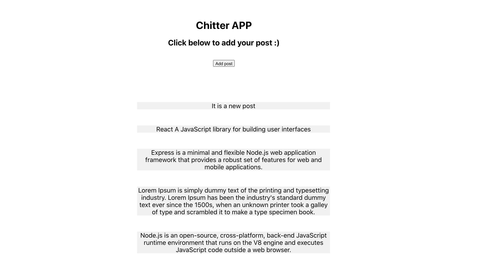
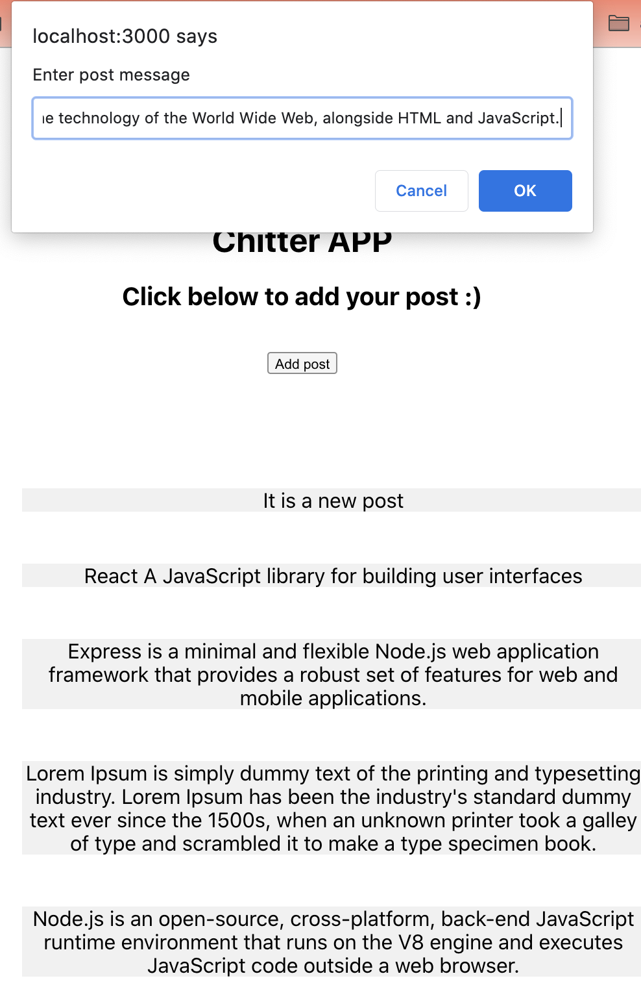
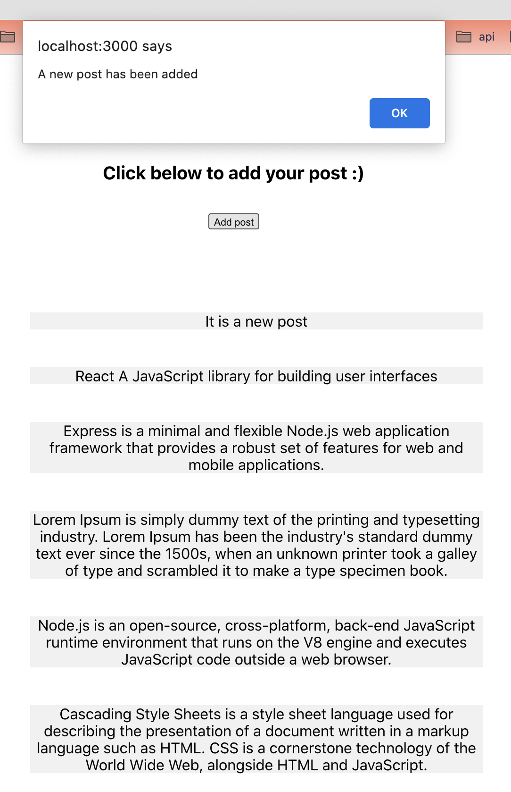

# Chitter 

Build a small Twitter clone using Javascript.

### How to run locally

``` 
git clone repo
cd chitter_js
npm install
node index.js
cd frontend
npm start

```


### Tech Summary


- Node 
- Express  
- React  
- Postgres 
- Javascript
- CSS  

### Chitter App



### Add a new post


### Successfully added a new post
